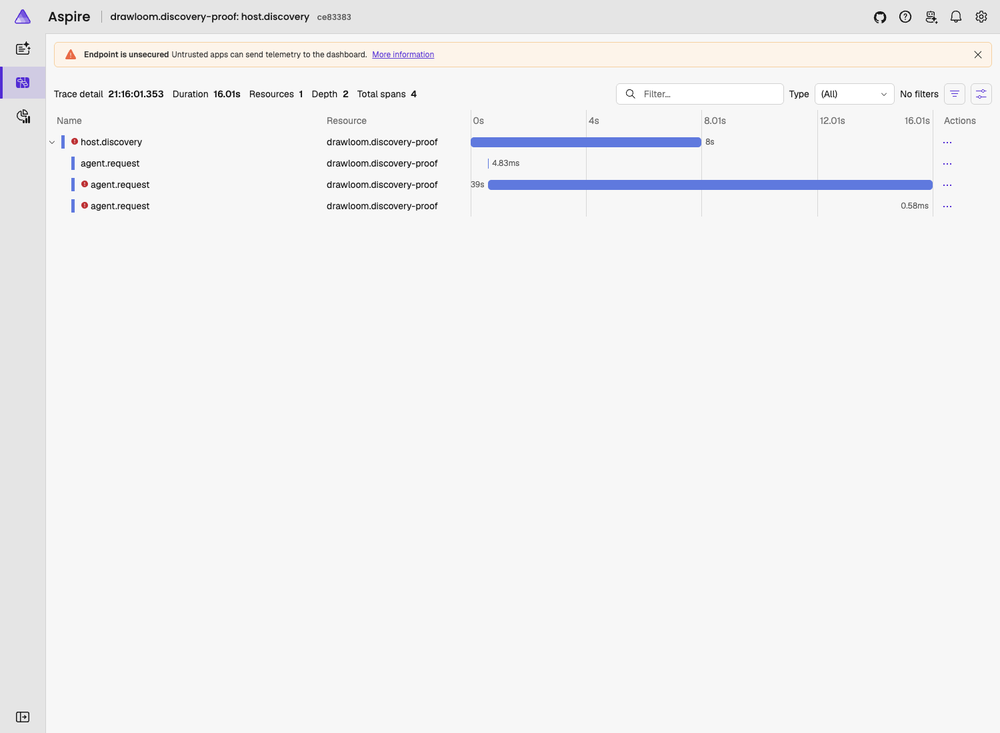

# ADR 0019 experiment

[ADR 0019](../../docs/adr/0019-useful-observability.md) was **Accepted** by the
maintainer on 2026-09-11. This record does not establish production readiness or a
backend/retention choice. Public baseline: `1ace5e7`; implementation is uncommitted.

## Scope and reproducibility

Real public Bun desktop, real OpenTelemetry SDK/OTLP and local Aspire viewer;
public synthetic document operations and retained local Temporal workflows.
Native Codex was used for read-only discovery, not model-performance measurement.
The installed private consumer's stages, live edit proof and screenshots are
recorded separately in `drawloom-workbenches/docs/adr-0019-observability-report.md`.
No private fixture, recipe, trace or screenshot is copied into this public record.

Tested on macOS/arm64 with Bun **1.2.23**, Node **24.20.0**, OTel API **1.9.1**,
trace/metrics SDK **2.11.0**, logs/OTLP packages **0.222.0**, MCP SDK **1.30.0**,
Aspire CLI **13.5.3**, Temporal TypeScript SDK **1.23.0**, Playwright **1.62.1**
and installed Google Chrome. These are tested versions, not a compatibility range.
Pinned dependencies are in the root catalog/lockfile. The viewer used loopback
ports 18889 (UI), 14318 (OTLP HTTP), 14317 (OTLP gRPC); no hosted service.

[Launchers and commands](../../spikes/adr-0019-observability/README.md) create
temporary runtime directories. The SDK has six isolated scenarios exercised in
both Bun and Node. No Node auto-instrumentation or native Rust tracing is assumed.

## Measured overhead

Each mode ran in its own process: one cold application creation, one warm-up,
then **30 warm repetitions** of discovery, a synthetic document action, terminal
display-state settlement, and two cached history pages. The benchmark calls the
real application; its HTTP span is synthetic, not a browser timing measurement.
No live model or paid generation is involved. Initial SDK setup is separate.

| Measurement | Disabled | Recording/discard | Local OTLP export |
| --- | ---: | ---: | ---: |
| SDK setup, ms | 0.308 | 2.505 | 3.439 |
| Cold app creation, ms | 27.206 | 25.175 | 24.122 |
| Warm median, ms | 2.660 | 3.072 | 3.357 |
| Warm p95, ms | 4.300 | 4.766 | 5.077 |
| Process user CPU, ms | 166.710 | 207.570 | 227.354 |
| Process system CPU, ms | 57.099 | 60.044 | 68.041 |
| Peak RSS, bytes | 181,977,088 | 182,632,448 | 180,092,928 |
| Recorded spans / logs | 0 / 0 | 249 / 187 | 249 / 187 |
| Transferred telemetry bytes | 0 | 0 | 201,382 |
| Export batches / failures | 0 / 0 | 0 / 0 | 3 / 0 |
| Known host queue drops | Not active | 0 | 0 |

Raw samples and per-stage timings: [disabled](assets/adr-0019/disabled.json),
[recording](assets/adr-0019/recording.json), [export](assets/adr-0019/export.json).
Counts include setup and warm-up; CPU includes setup and final flushing. Cold
times exclude module loading. Peak RSS is the entire process high-water mark,
not memory attributable to telemetry. Bun/macOS RSS units were cross-checked
against the system's peak-memory report; do not assume Node's KB units here.

Observed median increase: **0.698 ms, approximately 26%**, for local export on a
very small operation. This is a visible relative cost, not evidence of negligible
overhead. One process sample per mode cannot establish CPU/RSS causality; the lower
export-mode RSS and cold time are not claimed as improvements. Larger real-world
operations, throughput under sustained load and cross-machine variation remain open.

## What the traces explained

### Native discovery delay

Two real read-only calls reached the existing UI deadline after **8,004 ms** and
**8,003 ms**. Local registered contributions remained available. Native skill/app/
tool/resource categories showed unavailable/error fallback, rather than invented
readiness. [Per-request receipt](assets/adr-0019/discovery.json).

- Native connection completed in about **612 ms**.
- `skills/list` completed in **4.83 ms**, then **112.80 ms** on refresh.
- `app/list` remained pending beyond the display deadline. It ended after
  **15.39 s** / **7.89 s**, when the proof closed the host. These are interrupted
  observation durations, **not natural provider completion times**.
- `mcpServerStatus/list` was attempted only after those pending reads unwound,
  then rejected on the closing connection. It was not independently proved slow.
- Two app requests overlapped after explicit refresh; the display deadline did
  not retire the earlier provider request. No model or tool was invoked.

The trace and finite method attributes located the wait at the provider app-list
boundary without exposing inventory content. Source confirmation then identified
the sequential category reads in the existing adapter. Targeted follow-up:
independent category settlement, bounded cancellation/deduplication of abandoned
refreshes, and preservation of available categories. **Not implemented here.**
The source of the provider's internal delay is still unknown.

#### Follow-up diagnosis, 11 September

Reproduced through the unchanged desktop and existing instrumentation. The two
display deadlines were 8,008 ms and 8,002 ms. This time the first `app/list`
actually completed after 14,950 ms, followed by multiple short pagination calls;
the refresh still ended during host cleanup. The earlier interrupted observations
above are not retroactively treated as completed reads.

Two independent, read-only probes then bypassed Drawloom's combined catalogue
builder while reusing its stdio transport, launch configuration, 32 MiB transport
bound and `observedRpc` instrumentation. They created ephemeral native sessions;
no prompt, model turn, tool invocation or global configuration change was made.
Codex remained version 0.153.4. Only durations, counts and trace identities were
reported; native contribution names and payloads were not retained.

| Probe | Result |
| --- | --- |
| Independent concurrent `skills/list` | 5.03 ms, successful |
| Independent concurrent `mcpServerStatus/list` | 3,126.68 ms, successful |
| Independent concurrent cold `app/list`, first page | 15,847.07 ms, successful |
| Separate cold app pagination run, first page | 14,847.60 ms |
| Complete app catalogue | 37 pages, 3,681 entries, 16,465.96 ms |
| Subsequent cached first page in that same process | 60.08 ms |

The pagination receipt counted 4,933,486 JavaScript JSON string characters;
this is **not** an exact UTF-8 wire-byte measurement. Later individual pages
took approximately 29–67 ms. These are single diagnostic runs, not percentile
performance claims. A first probe accidentally used the transport's smaller
default bound and closed early; it was discarded and repeated with the actual
desktop's 32 MiB bound. Do not interpret that failed probe as provider latency.

Aspire traces: concurrent probe `d651c7ca5d2fdeb1c995d1449b2a3712`;
pagination/cache probe `5492cbeff6b5a9e7996761ebb70edf55`. Both exported without
reported failures or host queue losses. The ordinary desktop reproduction is
`a936dd21501e6efd18648285080c38c7` (first call).
The actual Aspire viewer confirmed overlapping requests and their independent
completion times: [isolated trace](assets/adr-0019/discovery-isolated.png).

Confirmed Drawloom causes:

1. [The deadline](../../apps/desktop/host/discovery-deadline.ts) is exactly 8,000 ms.
   It returns a fallback; it does not cancel the provider request.
2. [The host](../../apps/desktop/host/application.ts) prepares registered entries
   but waits for the combined native result before returning any catalogue.
   Deadline expiry reports native categories unavailable, including fast ones.
   Installed-package resource discovery is also awaited only after this native
   wait, further coupling otherwise separate sources.
3. [The adapter](../../packages/agent/codex-agent/src/discovery.ts) reads skills,
   every app page, then MCP tools/resources sequentially. The independent probe
   establishes that the native tool read need not wait for the slow app read.
4. Explicit refresh invalidates the pending-reference/cache state without retiring
   the earlier request. It can launch overlapping cold work. Cache publication
   happens only after the full category sequence and generation checks.

Recommended fix, **not implemented**: make registered/cached contributions
available immediately, let native categories settle independently, fetch additional
app pages on demand, and coalesce or safely retire overlapping refreshes. Preserve
selection revision validation, standard native discovery and permissions. Raising
the deadline alone would merely make users wait approximately 16 seconds here.
The exact reason for the provider's 15-second cold read remains outside Drawloom's
observed boundary; no claim of a specific upstream network or authentication fault.

Diagnostic effort: one approximately 16-second reproduction, inspection of its
two discovery traces and method-duration receipt, then a targeted source check.
Human inspection time was not separately timed; no general productivity gain
or time-saving percentage is asserted. The evidence answers *where we wait*, not
*why the provider takes that time internally*.

### UI and operation relationships

The actual public desktop trace showed `ui.request → http.request → host.command`
with connection, operation, submission and gateway spans below it: seven spans,
two resources, depth five. The default synthetic gateway denial correctly produced
no execution span. A real linked MCP transport test and the separate installed
consumer prove continued standard metadata to instrumented handlers.

Light/dark browser proof: two successful sends, zero page errors, authenticated
OTLP delivery HTTP 204. Sent-message plus draft-state visibility took **331 ms**
and **829 ms** in these two observations. Those values include UI polling and
are **not a 30-sample browser benchmark**. `ui.request` itself ends at response
headers, not completed painting. Screenshots were visually inspected:
[light](assets/adr-0019/desktop-light.png), [dark](assets/adr-0019/desktop-dark.png).

### Retries, overlap and continuation

The real local Temporal proof completed in **13,660 ms**. Shared conformance and
worker/service restart passed. Attempts at the input wait and after restart both
numbered **40**: completed work was not replayed as another execution. Branch
intervals overlapped by about **150 ms**. The safe task ran attempts 1 and 2;
the unrelated right branch completed once. Seven synthetic sessions retained
their identities and the final result was 15. Lost-response writes remained one.
Cancellation retained explicit unresolved owned work.

46 observation spans, zero exporter failures, zero known host drops. Both explicit
correlation checkpoint flushes reported true. Retry spans link prior attempts;
resume links the saved wait marker instead of pretending a span ran through
restart. Workflow code stayed unchanged. The independent bridge host stayed
alive: **no bridge-process/machine-restart recovery guarantee is established**.
Telemetry correlation persistence is bounded to 1,024 links, one active write
and a coalesced latest snapshot. Stalled/failing-sink tests prove task results and
errors return unchanged without waiting for diagnostic disk I/O or adding retries.

The actual Aspire span inspector showed a `workflow.resume` span with one link
to `workflow.wait`, rather than a continuous restart-spanning operation:
[continuation receipt](assets/adr-0019/continuation-link.png).

## Verification and design changes

- Concurrent host operations keep distinct parents and correlated log identities.
  Synthetic content/secret markers in names, attributes, errors, links and logs
  are absent from exported telemetry. Mutated context IDs and metric overflow
  dimensions received regression tests after independent review.
- Actual SDK trace/log/metric OTLP requests reached the local sink. Aspire showed
  trace relationships, linked structured logs and `operation.duration` metrics,
  not merely a successful HTTP export status.
  Viewer receipts: [logs](assets/adr-0019/logs.png),
  [metrics](assets/adr-0019/metrics.png). The metric graph includes earlier
  diagnostic iterations; the table above and raw JSON are the authoritative
  selected benchmark, not a percentile read from that graph.
- A deliberately stalled exporter with queue size two reported **17 queue-full
  drops** and returned within the test's 500 ms bound. Export/shutdown failures
  leave business results unchanged. Relay tests cover authentication, exact origin,
  oversized/invalid bodies, stalled ingestion and rate pressure.
- Typed failures are classified before the span ends. Denial is not an exception;
  terminal/uncertain agent outcomes remain distinct. Elicitation accept/decline/
  cancel outcomes are explicit; no provider-private approval-option inference.
- Cached history/resource reads retain ADR 0014 tests. The 10,000-entry history
  regression still transfers no body for unchanged state and does not invoke a
  provider for cached pages. Telemetry does not recapture media.
- Direct MCP App calls now propagate the host-owned standard parent; a failing
  real-MCP test preceded the correction. No new iframe protocol was introduced.
- Viewer inspection showed idle history polling filling the log stream. Removed
  its request/method spans; explicit pages remain. A regression prevents returning
  to per-poll tracing. This was an instrumentation change, not a polling rewrite.
- Public `bun install --frozen-lockfile` succeeded without lockfile changes.
  Canonical `bun run check:ci` passed: **511 tests, five explicit opt-in skips,
  zero failures, 2,495 assertions**; Node shared conformance also passed. Public
  build/dependency/architecture/UI checks passed. The existing large client chunk
  warning remains; Svelte reports zero errors/warnings.
- The private consumer's canonical gate and focused/live proofs are recorded in
  its private report. Public conformance requires no private package or service.
- Independent review found two important issues (typed-result misclassification
  and awaited diagnostic disk writes); both were fixed and targeted rereview
  reported no remaining Critical/Important findings.

## Reference comparison, limits and decision

DeepSeek telemetry sources were rechecked at
`b2e3b2a0125854567a4a5fcba75782e42fe84901`, unchanged from the survey.
[Its OTel backend](https://github.com/deepseek-ai/deepseek-harness/blob/b2e3b2a0125854567a4a5fcba75782e42fe84901/packages/session/session-telemetry-otel/src/index.ts)
uses SDK log batching and an outer shutdown deadline for feedback-authorised
session capture. Drawloom follows standard SDK mechanics but deliberately does
not copy that content-sharing policy or session ledger. No DeepSeek suite was run.

[MCP SEP-414](https://modelcontextprotocol.io/seps/414-request-meta),
[OTel JS](https://opentelemetry.io/docs/languages/js/), and
[standalone Aspire](https://aspire.dev/dashboard/standalone/) were checked on
10 September 2026. Successful propagation in our actual SDK transports does not
mean every third-party plugin supports child traces. Standard uninstrumented
plugins remain usable; Codex internal timing stays opaque.

Known gaps: browser queue loss before relay receipt is not measured; host/relay
zero drops cannot imply lossless end-to-end capture. Browser spans stop at headers.
No native Tauri/Rust IPC, hosted export, production retention, full-machine restart,
or long-duration stress result is claimed. The viewer's loopback OTLP endpoint is
unsecured (visible warning); its UI login is authenticated. No ports were exposed
beyond loopback, and no login credential is retained here.

The diagnostic value is demonstrated and the overhead is measured. The maintainer
accepted this trade-off on 2026-09-11 and authorised a cohesive commit, followed by
a separate verified discovery fix. No publication, global Codex change or
production migration occurred.
